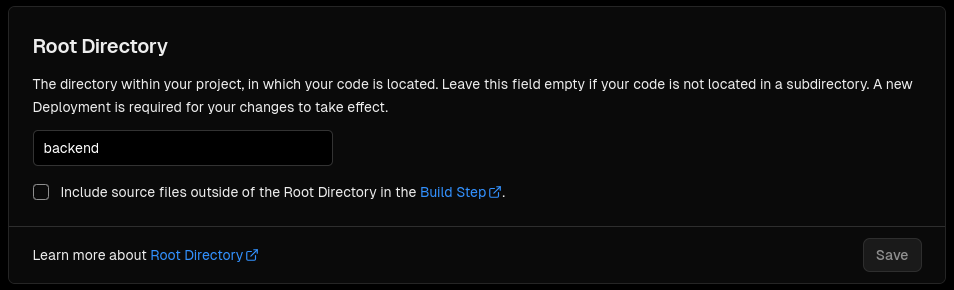

# fullstack-vue-fastapi-template

## Table of Contents

- [About](#about)
- [Requirements to run the project](#requirements-to-run-the-project)
- [How to run the project](#how-to-run-the-project)
- [How to deploy](#how-to-deploy)
  - [Frontend](#frontend)
  - [Backend](#backend)
- [Compatibility](#compatibility)
- [Contributing](#contributing)
- [Author](#author)
- [License](#license)

## About

A head start template for fullstack projects with integrated Vue front-end (bun/NodeJS) and FastAPI back-end (Python).

## Requirements to run the project

- `make` 4.3;
  - `sudo apt install build-essential` on Ubuntu (build-essential might be needed for `pyenv`); or
  - `sudo apt install make` on Ubuntu; or
  - `brew install make` on macOS; or
  - `choco install make` on Windows;
- Python 3.9.18;
  - Current Vercel supported version (but, if you're using more recent versions, it should probably work locally);
  - I personally recommend using [pyenv](https://github.com/pyenv/pyenv?tab=readme-ov-file#installation) for Python version management;
- Node.js v20.11.0;
  - I personally recommend using [nvm](https://github.com/nvm-sh/nvm?tab=readme-ov-file#installing-and-updating) for Node.js version management;
- Bun 1.0.26: install [here](https://bun.sh/);

## How to run the project

1. Clone the repository with:
   1. `git clone git@github.com:ArielMAJ/fullstack-vue-fastapi-template.git` (needs SSH key setup); or
   2. `git clone https://github.com/ArielMAJ/fullstack-vue-fastapi-template.git` (no need for SSH key setup);
   3. Download it if you don't have git and doesn't want to install it;
2. Change directory: `cd fullstack-vue-fastapi-template`;
3. Create `.env`'s from the `.env.example` files (you can just copy them as they are):
   ```bash
   make default-dot-envs
   ```
4. Install the dependencies:
   ```bash
   make install
   ```
5. Run the backend in a terminal:
   ```bash
   make run-api
   ```
6. Run the frontend in another terminal:
   ```bash
   make run-vue
   ```
7. Access the frontend at `http://localhost:8080/`.
8. Access the backend docs at `http://localhost:3000/docs` or `http://localhost:3000/redoc`.

## How to deploy

### Frontend

There are many possible ways to deploy the frontend. If you're using just the front-end part of the template, I recommend bringing the front-end to the root of the repository, and using Vercel to deploy it. You can also use GitHub Pages to deploy it and this is my personal recommendation if you're using both front and back end in the same repository.

To deploy with GitHub pages:

1. Access the equivalent of `https://github.com/ArielMAJ/fullstack-vue-fastapi-template/settings/pages` for your repository;
2. Select "deploy from a branch" and select `gh-pages` (create the branch if it doesn't exist);

GitHub Pages will automatically deploy the frontend from the `gh-pages` branch of the repository every time something is pushed there. You can do this manually by running `bun run build` and pushing the `dist` folder to the `gh-pages` branch of the repository (this might be a little confusing to do). My recommendation is to make use of GitHub Actions to automate the process. The [auto_deploy.yml](./.github/workflows/auto_deploy.yml) file is already set up for this:

Everytime you push to the `main` branch, the action will run and deploy the frontend to the `gh-pages` branch. You can check the status of the action in the "Actions" tab of the repository. If you want to use this action, you will need to set up the repository secrets and variables:

1.  Repository secret `ACCESS_TOKEN` (access the equivalent of `https://github.com/ArielMAJ/fullstack-vue-fastapi-template/settings/secrets/actions` for your repository);
    
    - You can generate a token [here](https://github.com/settings/tokens) and give it the `repo` scope;
      
    - This is needed for the `gh-pages` deployment (so the action can push to the `gh-pages` branch);
2.  Repository variable `VITE_APP_BACKEND_ROOT_ENDPOINT` (access the equivalent of `https://github.com/ArielMAJ/fullstack-vue-fastapi-template/settings/variables/actions` for your repository);
    
    - Set the value to the root endpoint of your backend (e.g. `https://fullstack-vue-fastapi-template.vercel.app/`);
    - This is needed for the frontend to know where the backend is located, this way you can easily change the backend location without changing the code (e.g. development will point to `http://localhost:3000/` and production will point to the PROD backend);

### Backend

I personally recommend Vercel for the backend, as it is the easiest to set up and use and it's free for personal projects. The [vercel.json](./vercel.json) file is already set up for this, but you're gonna need to change the root directory to your backend directory in Vercel:


Make sure to add any environment variables you create for your API in the Environment Variables section of the Vercel Project Settings.

Obs.: The backend packages are locally managed with `poetry`, but, for simplicity in Vercel deployment, the `requirements.txt` file is present in the folder as well. You can generate the `requirements.txt` file with the command `poetry export -f requirements.txt --output requirements.txt --without-hashes` in the `backend` directory. If you use the pre-commit hook, it will automatically generate the `requirements.txt` file for you when you commit.

## Compatibility

- Linux: works and is the primary development platform;
- WSL: should work;
- Windows: should work. The inital development stages were in Windows, but later migrated to Linux;
- MacOS: not tested.

## Contributing

Any and everyone is welcome to test this tool locally and leave feedback in the discussions/issues page. If you have some free time and are interested in it, please do. I would love to hear your thoughts and suggestions.

If you want to contribute to the project in any way, feel free to start issues, discussions and open pull requests. Check the [CONTRIBUTING](CONTRIBUTING.md) file for more information.

## Author

- [@ArielMAJ](https://ariel.artadevs.tech/): ariel.maj@hotmail.com

## License

This project is licensed under the MIT License - see the [LICENSE](LICENSE) file for details.
